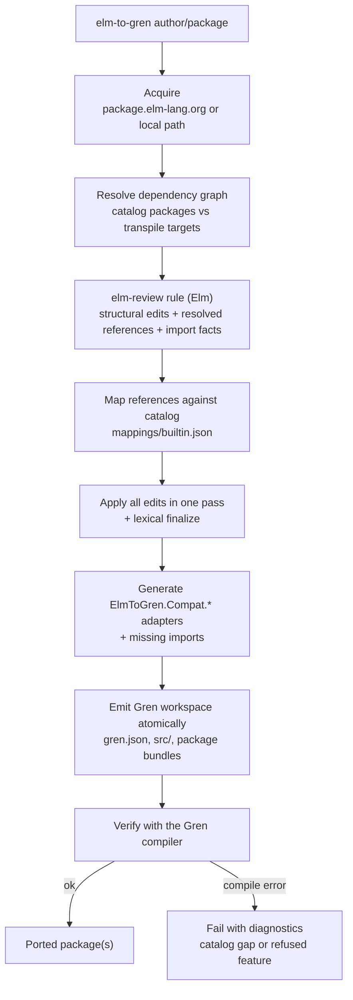

# Grenity

`elm-to-gren` — a Gren-native CLI that ports an Elm package and its whole
dependency graph into compiler-validated [Gren](https://gren-lang.org) packages.

Point it at an Elm package, get an installable Gren workspace back:

```sh
npm install
npm run build
node bin/elm-to-gren.cjs elm-community/list-extra --out ./out --cache ./cache
cd out && gren docs   # the output compiles with the official Gren compiler
```

## How it works



1. **Acquire** the Elm package and resolve its dependency graph
   (package.elm-lang.org or a local path).
2. **Analyze** every module with a custom [elm-review](https://package.elm-lang.org/packages/jfmengels/elm-review/latest/)
   rule that emits AST-derived structural edits (`case`→`when`, tuples→records,
   list cons→`Array` operations) plus every resolved value/type reference and
   import, keyed by source range.
3. **Map** those references against a package/API catalog
   (`mappings/builtin.json`): `List.filter`→`Array.keepIf`,
   `Basics.round`→`Math.round`, `elm/regex`→`String.Regex`, and so on.
   Unmapped gaps are bridged by generated `ElmToGren.Compat.*` adapter modules.
4. **Emit** Gren manifests, sources, and package bundles atomically, then
   **verify** the result with the real Gren compiler before publishing the
   workspace.

## What ports

Pure library packages over `elm/core` (plus `elm/json`, `elm/time`,
`elm/random`, `elm/bytes`, `elm/regex`, `elm/url`, `elm/parser`) are the
supported path — `elm-community/list-extra` and `rtfeldman/elm-hex` are the
reference targets. Unknown dependencies are transpiled recursively.

Refused with a diagnostic (no portable translation exists):

- port modules and port declarations
- effect modules and `Elm.Kernel` / `Native` code
- GLSL shader expressions
- identifiers named `when` / `is` (Gren reserved words)

List patterns are rewritten for Gren arrays: `x :: xs` becomes
`Array.popFirst` with `Just { first, rest }`, multi-cons (`x :: y :: rest`)
nests further `popFirst` in the branch body, and uncons under `Maybe`,
`Result`, or other single-argument constructors is rewritten in place.

API gaps in cataloged modules surface as real Gren compile errors at the
verify step; the fix is a catalog entry or adapter, not code.

## Ecosystem smoke tests

`npm run test:ecosystem` ports 20 randomly selected (seeded) pure Elm packages
whose direct dependencies stay within the supported platform set
(`elm/core`, `elm/json`, `elm/time`, `elm/random`, `elm/bytes`, `elm/regex`,
`elm/url`, `elm/parser`) and checks that each run completes with verification.

## Development

```sh
npm run test:all        # unit, rule fixtures, e2e, ecosystem (network)
npm run test:ecosystem  # 20 seeded pure packages from package.elm-lang.org
```

- `src/` — the Gren CLI (acquire, resolve, transform, emit, verify)
- `review/` — the elm-review rule that produces edits, references, and imports
- `mappings/builtin.json` — the Elm→Gren package/API catalog
- `test/` — unit, end-to-end, and ecosystem suites
- `test/ecosystem/packages.json` — seeded sample of qualifying registry packages

## License

MIT
